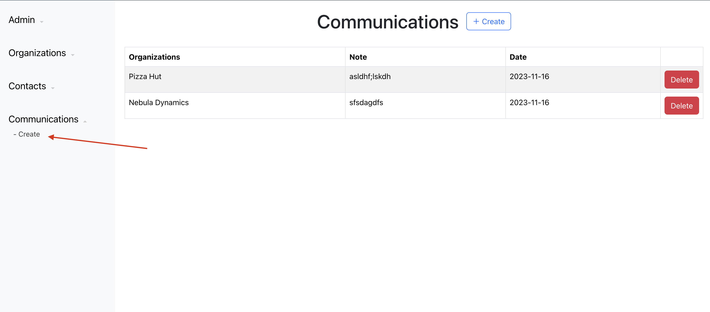
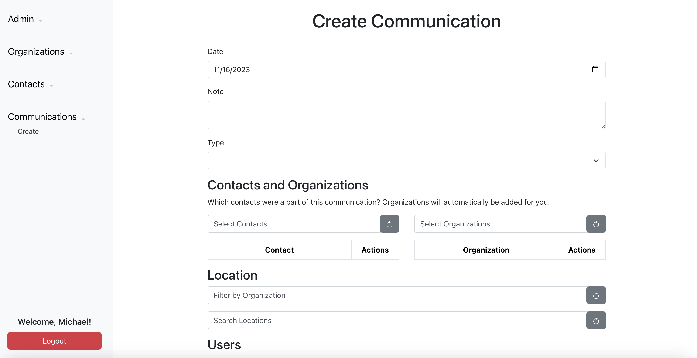
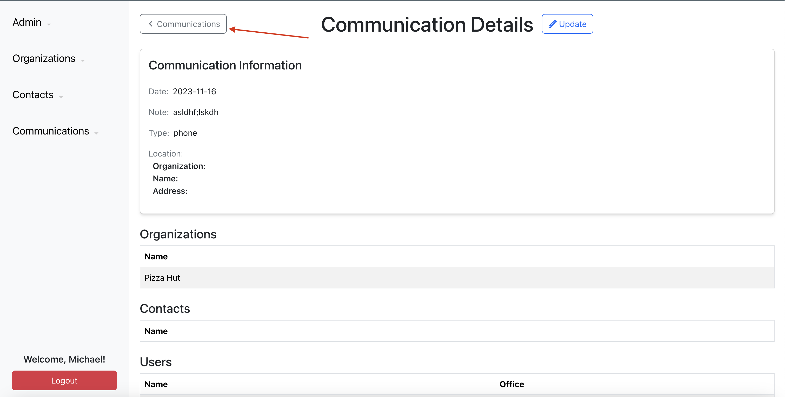

Before beginning any testing, please contact Team Community to get permissions to use the site. All features are locked down.

- Export all Organization into an Excel sheet

  - Navigate to https://community-9eef4.web.app/
  - If you aren't already logged in, click the "Login" button in the center of the screen.
    - Follow the on-screen prompt to finish the login process.
  - On the sidebar, click on "Organizations".
  - Verify that you were directed to the Organizations page.
  - Verify that below the Organizations table, you should see an "Export" button.
  - Click on the Export button.
  - Verify that an Excel file, named starting with "Organizations" was downloaded.
  - Open the Organizations excel file.
  - Verify the Organizations in the Excel file match exactly as they do on the Organizations page.

- Contact Search Aliases

  - Navigate to https://community-9eef4.web.app/
  - If you aren't already logged in, click the "Login" button in the center of the screen.
    - Follow the on-screen prompt to finish the login process.
  - On the sidebar, click the arrow next to "Contacts" so you can see the "Create" submenu.
  - Under "Contacts" on the sidebar, click on "Create"
  - Verify that you were directed to the Create Contact page.
  - Fill out the form:
    - Name
    - Aliases
      - You will need to add an alias to complete this test.
      - Click on "Add Row"
      - Type the Alias you would like to use.
    - Organizations
      - Click the Search Organizations bar above the empty table
      - Choose any Organization
      - Add an email or phone number for the contact you are creating, located at the organization.
  - Click on "Create"
  - Verify that the Contact was created.
  - On the sidebar, click the arrow next to "Communications" so you can see the "Create" submenu.
  - Under "Communications" on the sidebar, click on "Create"
  - Verify that you were redirected to Communications Create page.
  - Under "Contacts and Organizations", search for contacts.
    - Search by the contact's name.
    - Verify that it appears in the search results.
    - Search by the contact's alias
    - Verify that it appears in the search results. It should show as (alias) Contact Name, where alias and contact name are replaced by the actual alias and contact name.

- Create Communication

  - On the sidebar, click the arrow next to "Communications" so you can see the "Create" submenu.
  - Under "Communications" on the sidebar, click on "Create"
    
  - Verify that you were redirected to Communications Create page.
    
  - Fill out the form:
    - Date
    - Note
    - Type (Select a type from the dropdown)
    - Contact (select a contact from the dropdown)
    - Organization (select an organization from the dropdown)
    - Location (select organization location from the dropdown)
    - User (Select 1-5 users from the dropdown)
  - Click on "Create"
  - Verify that you are redirected to the communication details page
  - Go through the communication details page and make sure the information matches the details you added
  - On the top left of the page, click the "Communications" button
    
  - You should be taken back to the main communications page
  - Verify that you can see the communication you just added in the communications table
